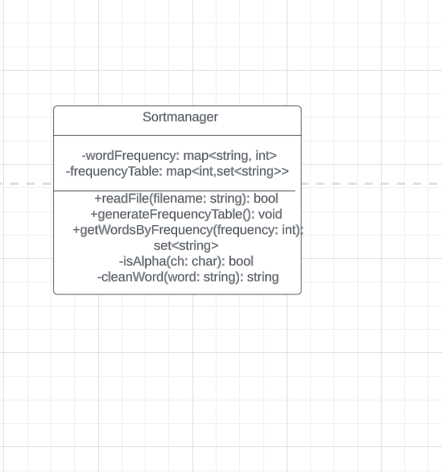

# WordReader

The WordReader is a versatile application designed to analyze text files for word usage patterns. With this tool, users can calculate the frequency of specific words within a file and identify words that appear a significant number of times. Additionally, the application offers the functionality to pinpoint the most commonly used word in a file.

One of the invaluable utilities of the WordReader is its ability to facilitate literary analysis. By assessing word frequency, users can gain insights into the mood or themes that an author may have intended to convey. For example, the prevalence of words associated with sadness or joy can hint at the underlying tone of the text.

In the development of this application, I employed object-oriented programming principles to ensure a modular and scalable codebase. Furthermore, I utilized data structures such as maps and sets, which are instrumental in efficiently managing and manipulating data. In addition to these programming constructs, the application's development involved navigating the SDL learning curve, which contributed to a more polished and effective product.

### HOW TO USE

1. To be able to use this program you would first need to build the porgram in your code editor.
2. Make sure the e-book taht you want to analyze is saved in the same folder as the porgam in a txt file or in a plain text form (UTF-8)
3. The application wouldprompt you to enter the name (with extension) of the text file you wish to analyze.
4. The application would then ask you how the N number of requency that you want to see and also the words that appear that Nth amount of time , please input the number
5. The application will read the file, clean the words (remove non-alphabetic characters), and compute the frequency of each word.
6. After the analysis, you can query words by their frequency. For example, to find all words that occur twice:
7. The application will display all words that occur with the frequency you entered.

## Analyzing a Fresh E-book

To analyze a new e-book:

1. Download the e-book in plain text form (UTF-8).
2. Save the e-book to the same directory as the compiled WordFrequencyAnalyzer application.
3. Run the WordFrequencyAnalyzer and enter the filename of the e-book when prompted.
4. Query the word frequencies as desired.

##### Note

The application is not case sensitive , to avoid complications and mixup all the words have been turned into lowercase letters and also any word buffered by whitspace is considered a word . Non-alphabetic characters in wrods are removed during analysis.

#### Use Cases

##### Title: Analyzing Word Frequencies in a Book

Primary Actor: User

Goal in Context: To analyze and understand how frequently each word occurs in a book.

Stakeholders: User

Preconditions: The plain text file of the book is available.

Main Success Scenario:

User provides the path to the plain text file.

The application reads the file, splitting it into its constituent words.

The application cleans each word (e.g., converts to lowercase, removes punctuation).

The application stores these words in an associative data structure, keeping track of how frequently each word occurs.

The application generates and displays a table showing the words by frequency.'

##### Analyzing Literary Works:

Description: An author or literary analyst can use this application to analyze the vocabulary diversity in a book or collection of poems. By finding words that are used repeatedly,

they can evaluate the author’s style and word choice.

Example: An English literature student uses the application to find

the words that are used most frequently in Shakespeare's

"Romeo and Juliet".

They analyze the results to understand the main themes and motifs of the play.

##### Identifying Trends in Research Articles:

Description:

Researchers and academicians can use the WordReader application to analyze research articles or journals to identify trending keywords in their field of study. By understanding which terms are frequently used, they can stay abreast with the current themes and directions in research.

Example:

A data scientist utilizes the WordReader to analyze multiple research papers published in the last year on Artificial Intelligence. Through identifying the most frequently used terms, they can understand the latest technologies and approaches that are trending in the AI community.
