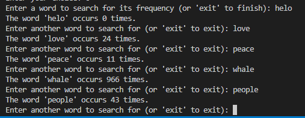
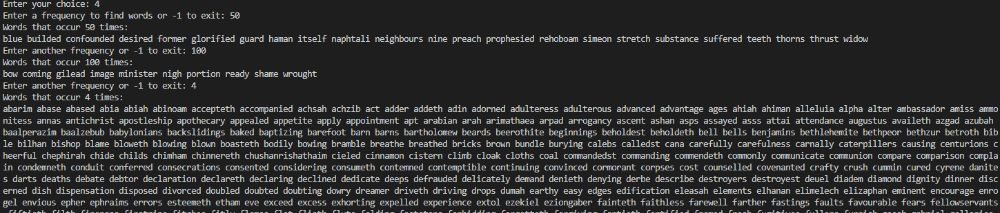
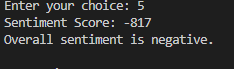
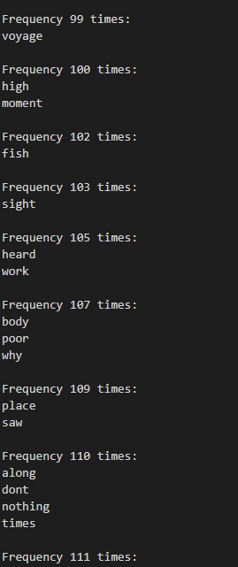
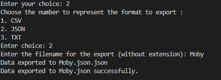
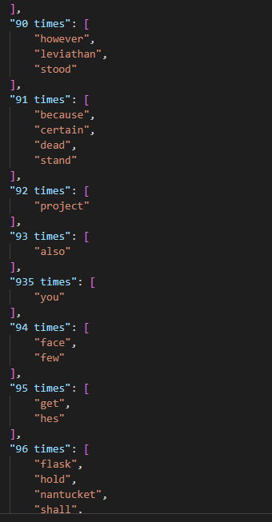
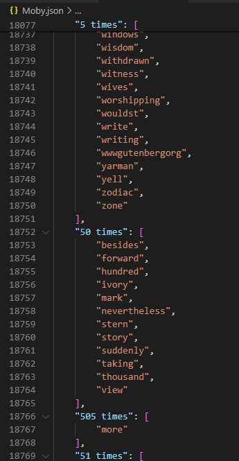
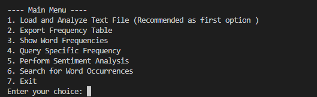

# Text Frequency Analyzer Application

## Overview

The Text Frequency Analyzer Application is a comprehensive tool designed to analyze text data. It provides insights into word usage patterns, offering detailed reports on frequency, sentiment, and exporting capabilities for further analysis.

## Key Features

### Frequency Calculation

* **Purpose** : Analyze and determine the frequency of each word within a given text file.
* **How It Works** : The application scans the entire text, counts each occurrence of every word, and stores these counts. This feature is fundamental for understanding which words are most prevalent and may determine the focus of the text.
* 

### Top Word Identification

* **Purpose** : Identify and report the most frequently appearing words in the text.
* **How It Works** : After calculating word frequencies, the application sorts these frequencies to highlight the most common words. This is particularly useful for quickly identifying key themes or subjects within large volumes of text.
* 

### Sentiment Analysis

* **Purpose** : Assess the emotional tone of the text, classifying it as positive, negative, or neutral based on the usage of predefined sentiment-laden words.
* **How It Works** : Utilizes two lists of words known for their positive or negative connotations. The program counts occurrences of these words and calculates a sentiment score, which indicates the overall emotional bias of the text.

  

### Data Export

* **Purpose** : Allow users to export the analyzed data for use in other applications or for record-keeping.
* **How It Works** : Users can choose to export the frequency data in three formats: CSV, JSON, or TXT. Each format serves different needs, such as statistical analysis in spreadsheets (CSV), data interchange between applications (JSON), or simple text records (TXT)
* .
* 

## Goals

* **Enhance Textual Understanding** : Help users gain deeper insights into their textual content, whether for academic, professional, or personal purposes.
* **Support Data Analysis** : Provide robust data export options that support further analysis in tools like Excel, R, or Python.
* **User-Friendly Interface** : Maintain a simple, menu-driven interface that can be easily navigated by users of all technical levels.

## Instructions for Use

### Setup

Compile the program using a C++ compiler, ensuring all dependencies like the JSON library are correctly configured.

### Launch & Input

Run the program and follow the prompts to load and analyze your text file.

### Menu-Driven Interface

Navigate through the application using the numbered menu to access different functionalities:

* **1. Load and Analyze Text File** : Crucial first step for all further analyses.
* **2. Export Frequency Table** : Choose from CSV, JSON, or TXT formats.
* **3. Show Word Frequencies** : Displays frequencies up to a user-specified limit.
* **4. Query Specific Frequency** : Look up how often certain frequencies occur.
* **5. Perform Sentiment Analysis** : Analyze the emotional tone of the text.
* **6. Search for Word Occurrences** : Find the frequency of specific words.
* **7. Exit** : Safely exit the application.

## Use Cases

### Analyzing Academic Texts

* **Scenario** : A researcher analyzing the frequency of technical terms in scientific articles to study trends.
* **Process** : Load the article, analyze it, and export the data to CSV for further trend analysis.

### Literary Analysis

* **Scenario** : A literature student examines the use of certain themes or words in a novel.
* **Process** : After analyzing the text, the student uses the sentiment analysis feature to understand the emotional undertone of different chapters.

### Content Strategy Development

* **Scenario** : A content marketer evaluates commonly used words in successful blog posts.
* **Process** : The marketer analyzes several posts, compares word frequencies, and identifies potential keywords for SEO.

## Future Additions

* **Advanced Sentiment Analysis** : Implement machine learning models to enhance sentiment analysis accuracy.
* **Language Support** : Extend the application to support multiple languages, accommodating a broader user base.
* **Graphical User Interface (GUI)** : Develop a GUI to make the application more accessible to non-technical users.

## Conclusion

The Text Frequency Analyzer Application is built to provide detailed insights into text files, aiding users in understanding and utilizing their textual data effectively. By maintaining a focus on user-friendliness and functionality, it serves as a valuable tool for a wide array of textual analysis tasks.
